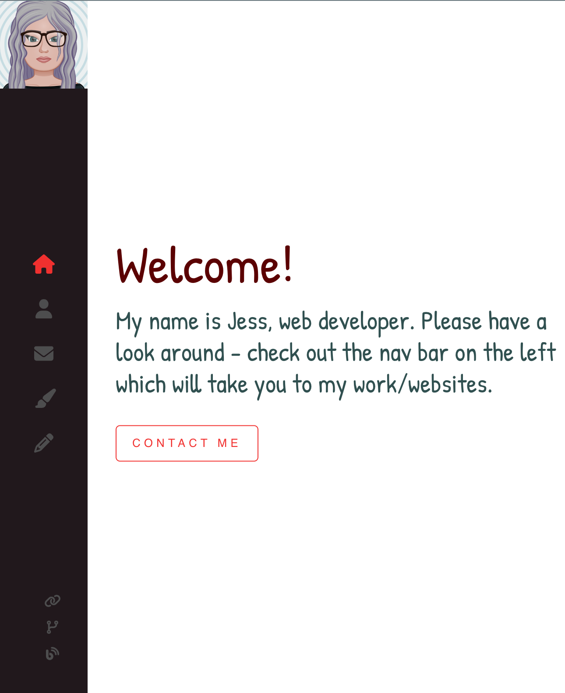
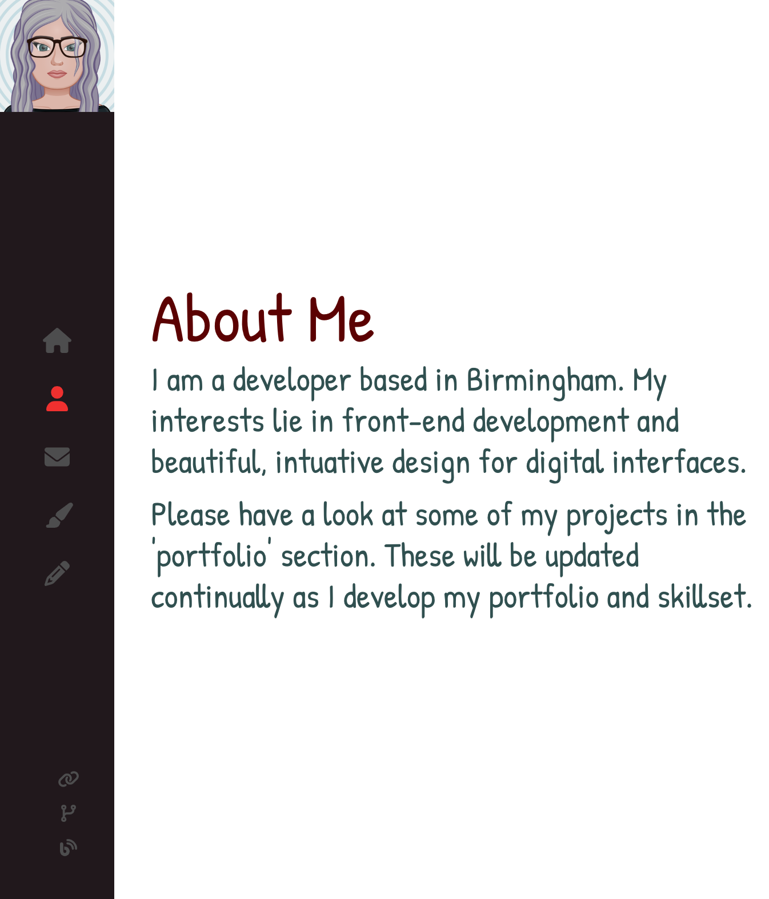
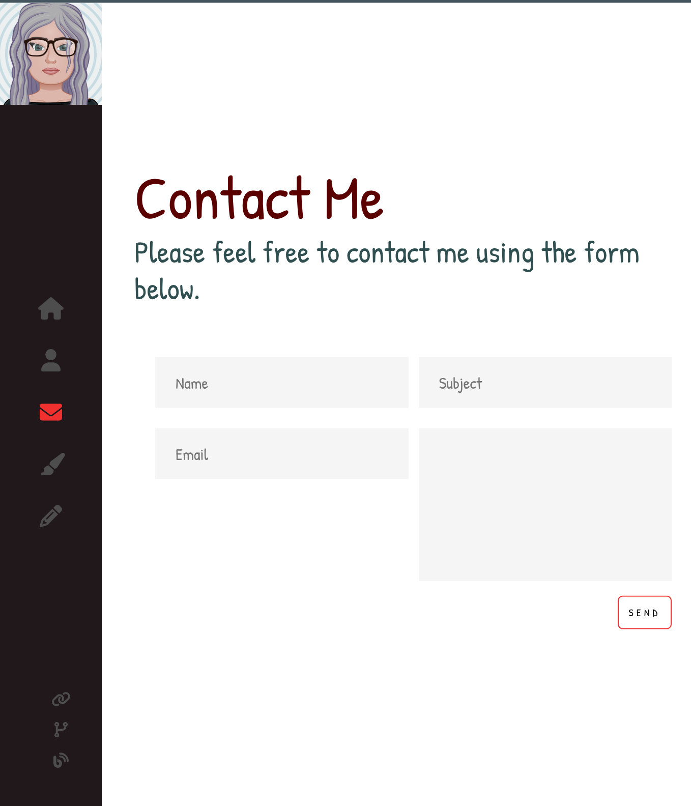
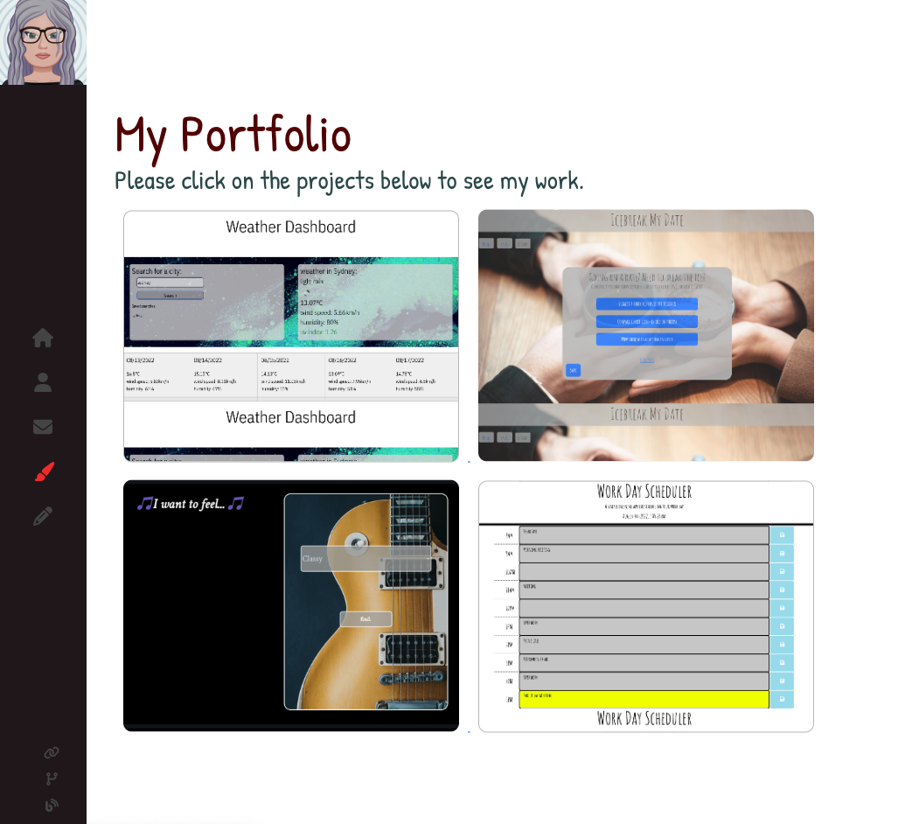
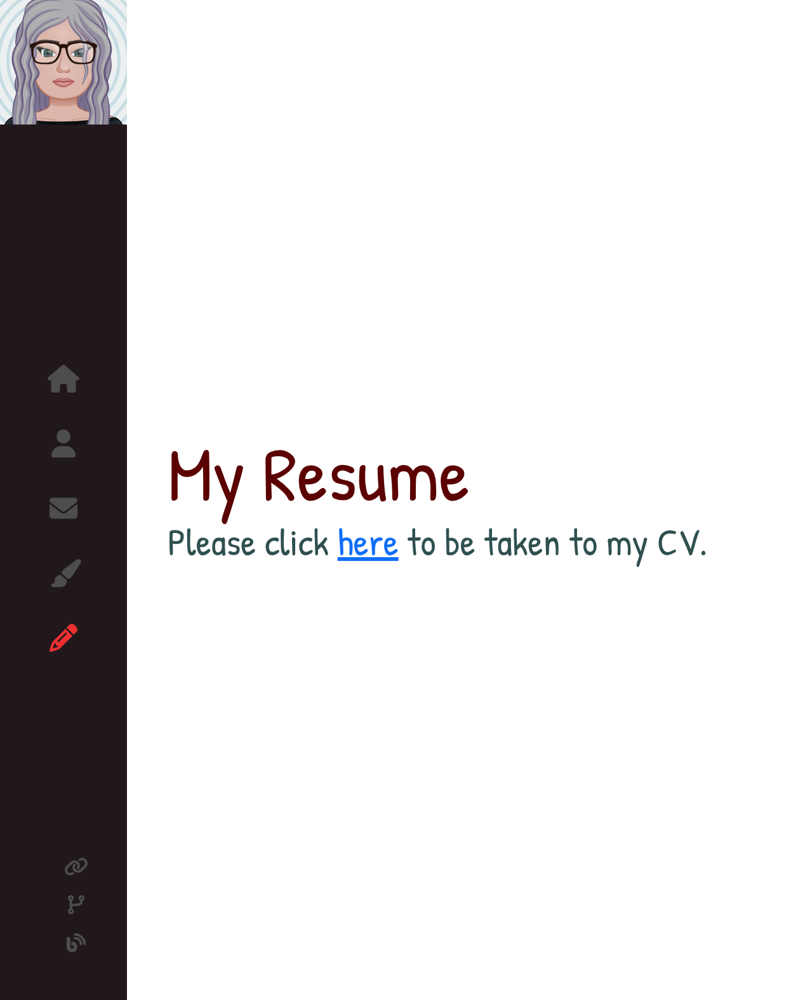
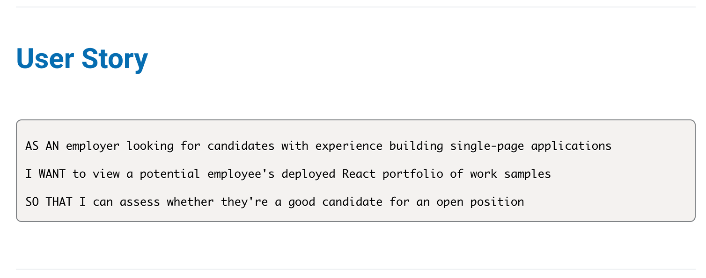

# React Portfolio
- Challenge 20 assignment for UoB Bootcamp due 21-11-22
- Deployed URL: 

Images of deployed web page:

Contents:

1. Summary
2. Key features
3. Issues encountered/further amendments
4. Credits

## 1. Summary

This project was undertaken as a submission for a Birmingham University Bootcamp assignment, with a brief to create a React portfolio to showcase projects.

The user story is as follows:

## 2. Key features:

- A 'Sidebar' encompassing Header and Footer that appears on all pages
- Sidebar navigation conditionally renders to each section of the portfolio
- A 'Home' section that welcomes to user to the developer's web page
- An 'About' component that gives information about the developer, with a link to the 'contact' page
- A 'Contact' component which gives information on how to contact the developer, including a contact form which allows you to contact the developer without using an API
- A 'Portfolio' component which links to the developer's projects
- A 'Resume' component which gives a link to the developer's CV
- Footer icons which link to the developer's Github, Linkedin and personal blog
- SCSS for styling and animations

## 3. Issues encountered/further amendments

Please see commented out code for detail of issues/further amendments needed, but summary is below:

- TODO: optimize for other screen sizes using media queries 
- TODO: embed CV into Resume page
- TODO: include further, updated projects on Portfolio page
- TODO: update with more advanced animations to showcase frontend skills

## 4. Credits
- Help on creating animations in React and SCSS: https://www.youtube.com/watch?v=bmpI252DmiI 